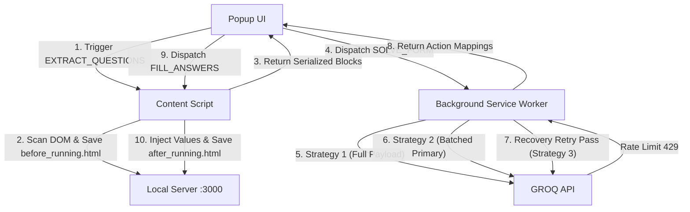

# FormAI - Google Forms Automation Playbook & Technical Blueprint

This document outlines the complete system architecture, advanced DOM manipulation techniques, framework workarounds, and known limitations of the FormAI Chrome Extension.

---

## 1. System Architecture & Complete Workflow

FormAI uses a distributed three-layer architecture to scrape, solve, and fill Google Forms safely, bypassing API rate limits and complex client-side framework listeners.



### Stage-by-Stage Process

1. **Extraction (`content.js`)**:
   - Triggered by the user clicking **Solve Form** in the popup.
   - Saves a local snapshot of the page to `before_running.html` via the background script.
   - Scans the form layout, filters outer containers, isolates interactive components, and builds a clean JSON representation of questions and option lists.
2. **Orchestration (`background.js`)**:
   - Receives the serialized questions and loads your stored context/profile.
   - **Strategy 1 (Full Payload)**: Attempts to send the entire form to the LLM in a single request. If the prompt exceeds Groq's 6,000 TPM limit or returns an HTTP 429, it fails over.
   - **Strategy 2 (Batched Primary)**: Divides the blocks into chunks (4 blocks/batch) and processes them sequentially with a 12-second safety cooldown between requests.
   - **Proactive Rate-Limit Wait**: If all keys are rate-limited, the worker calculates the shortest remaining cooldown time, sleeps for it, and clears the rate limit to retry, preventing cascading empty padding failures.
   - **Strategy 3 (Recovery Pass)**: Inspects the batch results. Any missing or malformed JSON blocks are retried individually before returning the final solution.
3. **Execution (`content.js`)**:
   - Iterates through the solved blocks and injects responses into the target inputs.
   - Dynamically opens dropdowns, matches options using a tiered fuzzy algorithm, dispatches pointer click sequences, and verifies menu closure.
   - Saves a final local snapshot to `after_running.html`.

---

## 2. Advanced DOM Scanning & Manipulation Playbook

Google Forms uses Google's internal **WIZ rendering framework**, which relies on dynamic DOM mutations, virtual focus states, and custom components. Below are the techniques and workarounds implemented to handle WIZ forms.

### A. Group-Aware Form Scanning (Outer Block Isolation)
Google Forms nests question blocks inside multiple wrapper divs (e.g., `div[role="listitem"]` and `.Qr7Oae`). Naive query selectors will match both parent and nested blocks, creating duplicate scanning.
* **Workaround**: We extract all potential blocks, then filter them by removing any block that is contained inside another block:
  ```javascript
  const blocks = Array.from(document.querySelectorAll('div[role="listitem"], .Qr7Oae'));
  const outermostBlocks = blocks.filter(b => !blocks.some(parent => parent !== b && parent.contains(b)));
  ```

### B. Layout-Independent Visibility Engine
Modern browsers throttle layout, reflow, and paint calculations for background tabs, minimized windows, or when overlapping overlays (like Chrome extension popups) are open. In these throttled states, `getBoundingClientRect()` returns `0` width and height.
* **The Trick**: Instead of checking dimensions to see if a dropdown options menu is open, we inspect structural DOM updates and styling states:
  - Check if the options container `.OA0qNb` contains option elements (`querySelectorAll('[role="option"]').length > 0`).
  - Verify that the element's computed display is not `'none'` and visibility is not `'hidden'`.
  This allows the wait loop to resolve in **0-100ms** even when running in the background, instead of timing out at 1.5 seconds.

### C. WIZ-Aware Pointer Event Delegation
WIZ registers action listeners on parent nodes using custom attributes (`jsaction`) and matches events based on child targets (`jsname`). For dropdown listboxes:
- The parent listens to actions matching `click:cOuCgd(LgbsSe)`.
- If a click is dispatched to the outer `role="listbox"` container directly, WIZ ignores it.
- **The Trick**: We route the click sequence to the inner child node that has `jsname="LgbsSe"` or class `.ry3kXd`:
  ```javascript
  let clickTarget = element;
  if (element.getAttribute('role') === 'listbox') {
    const innerTarget = element.querySelector('[jsname="LgbsSe"]') || element.querySelector('.ry3kXd');
    if (innerTarget) clickTarget = innerTarget;
  }
  ```

### D. Closed-State Options Scrape (Preloaded Scan)
When a Google Forms dropdown is closed, the option elements are stored under a static presentation placeholder (Child 1). When opened, WIZ dynamically moves the elements into the active options container `.OA0qNb` (Child 2).
- **The Trick**: Instead of forcing the dropdown open to scrape options during the scan phase, we query the closed placeholder hierarchy:
  ```javascript
  const hasOptions = optionsContainer && optionsContainer.querySelectorAll('[role="option"]').length > 0;
  const searchRoot = (optionsContainer && hasOptions) ? optionsContainer : dropdown;
  ```
  This allows us to scrape all options *before* starting form execution, avoiding redundant open/close animation delays on scan.

### E. Tiered Selection & Fuzzy Matching
Dropdown answers returned by the LLM may differ slightly in casing or formatting (e.g. `viswakarma institute of technology` vs `Vishwakarma Institute of Technology`). We resolve this using a tiered matching algorithm:
1. **Normalization**: Remove all whitespace, capitalization, and non-alphanumeric characters.
2. **Tier 1 (Exact)**: `normOption === normTarget`.
3. **Tier 2 (Substring)**: `normOption.includes(normTarget)` or `normTarget.includes(normOption)`.
4. **Tier 3 (Fuzzy)**: Compute Levenshtein Distance and calculate a similarity score:
   $$\text{Similarity} = 1.0 - \frac{\text{Distance}}{\max(\text{length}_1, \text{length}_2)}$$
   Matches above `0.70` (70%) are accepted.

### F. Native Framework Value Injection
Google Forms inputs are wrapped in virtual frameworks. Updating `input.value = "text"` directly only changes the visual text; it does not update the underlying state, causing the input to clear upon form submission.
- **The Trick**: We override the element's native value setter and dispatch bubbling framework events:
  ```javascript
  const nativeInputSetter = Object.getOwnPropertyDescriptor(window.HTMLInputElement.prototype, "value")?.set;
  nativeInputSetter.call(inputElement, text);
  inputElement.dispatchEvent(new Event('input', { bubbles: true }));
  inputElement.dispatchEvent(new Event('change', { bubbles: true }));
  inputElement.dispatchEvent(new KeyboardEvent('keyup', { bubbles: true }));
  ```

### G. Temporary Form-Specific Context (Interactive Chat-Input)
While the user profile provides permanent details (e.g. name, email, permanent registrations), users often need to direct the LLM's solving behavior for a specific form run only (e.g. "Fill this with dummy answers", "Answer as if you are a CS student", or "Solve this for my school report").
- **The Workaround**: The popup UI includes a `chat-input` text region. On clicking **Solve Form**, the popup captures this text and sends it to the background orchestrator under `tempInstruction`. The orchestrator dynamically appends it to the system instructions prompt as temporary instructions for this run only, without modifying the user's permanent profile data.

---

## 3. Extension Limitations

While the current implementation is highly robust, users should be aware of the following design constraints and browser limitations:

### 1. API Rate Limits (TPM / RPM)
- **Constraint**: Free-tier API keys (especially Groq's `llama-3.1-8b-instant`) are limited to **6,000 Tokens Per Minute (TPM)**. 
- **Impact**: Large forms with complex prompts will exceed this limit on Strategy 1. While Strategy 2 (Batching) successfully bypasses this by splitting prompts, the 12-second cooldown sleep means a 20-block form will take ~1 minute to solve. Adding multiple API keys or upgrading to a paid tier solves this issue.

### 2. Multi-Section Forms (Multi-page)
- **Constraint**: Google Forms pages are rendered one section at a time. The DOM only contains elements for the current active section.
- **Impact**: FormAI can only scan and solve the visible page. Once a section is filled, the user must click "Next" manually (or the solver completes the section), and then click **Solve Form** again on the next page.

### 3. Dynamic Conditional Logic (Conditional Branching)
- **Constraint**: Some dropdown or multiple choice selections dynamically generate new question blocks on the page.
- **Impact**: Since these blocks do not exist in the DOM during the initial scan, the LLM will not have generated answers for them. The user will need to re-click **Solve Form** to scan and fill the newly appeared questions.

### 4. Background Tab Layout Halts
- **Constraint**: Chrome pauses layout rendering for background tabs.
- **Impact**: Standard pointer mouse events and focus changes may behave differently or be delayed by the browser engine until the tab returns to the foreground. Keeping the form tab visible while solving is recommended.
